# Intonational Travel Platform — Architecture

```mermaid
graph TD

    CLIENT[External Client / Frontend]

    %% ── AGGREGATOR LAYER ──────────────────────────────────────────────
    subgraph AGG [Aggregator Layer]
        AGG_APP[aggregator-service<br/>GET /api/v1/aggregator]
        AGG_REDIS[(Redis<br/>aggregate cache<br/>TTL 1h)]
        AGG_STATIC[static_client.py]
        AGG_DYNAMIC[dynamic_client.py]
        AGG_UTIL[wmo_converter.py<br/>cache_keygen.py]

        AGG_APP -->|cache read/write| AGG_REDIS
        AGG_APP --> AGG_STATIC
        AGG_APP --> AGG_DYNAMIC
        AGG_APP --> AGG_UTIL
    end

    %% ── STATIC DATA LAYER ─────────────────────────────────────────────
    subgraph STATIC [Static-Data Layer]
        GEO_SVC[geocoding/service.py<br/>GET /api/v1/geocode]
        GEO_REPO[(MongoDB<br/>geocodes<br/>TTL 1yr)]

        HW_SVC[weather_historical/service.py<br/>GET /api/v1/historical-weather]
        HW_REPO[(MongoDB<br/>historical_weather<br/>TTL 1yr)]

        ADV_SVC[advisories/service.py<br/>GET /api/v1/advisories]
        ADV_REPO[(MongoDB<br/>country_advisories<br/>TTL 6mo)]
        ADV_SCRAPE[advisories/scrape.py<br/>Playwright + BeautifulSoup]
        ADV_CSV[[data/country_links.csv<br/>data/country_data.csv]]

        STATIC_SHARED[shared/http.py<br/>shared/db/mongo.py]

        GEO_SVC -->|read/write| GEO_REPO
        GEO_SVC --> STATIC_SHARED
        HW_SVC -->|read/write| HW_REPO
        HW_SVC --> STATIC_SHARED
        ADV_SVC -->|read| ADV_REPO
        ADV_SVC --> STATIC_SHARED
        ADV_SCRAPE -->|upsert| ADV_REPO
        ADV_SCRAPE --> ADV_CSV
    end

    %% ── DYNAMIC DATA LAYER ────────────────────────────────────────────
    subgraph DYNAMIC [Dynamic-Data Layer]
        WF_SVC[weather_forecast/service.py<br/>GET /api/v1/weather-forecast]
        WF_REDIS[(Redis<br/>weather cache<br/>TTL 24h)]

        FX_SVC[fx_rates/service.py<br/>GET /api/v1/fxrates]
        FX_REDIS[(Redis<br/>fx rates cache<br/>TTL 8h)]

        DYN_SHARED[shared/http.py<br/>shared/redis/<br/>cache_keygen.py]
        DYN_CONFIG[config.py<br/>Pydantic Settings<br/>.env FX_API_KEY]

        WF_SVC -->|read/write| WF_REDIS
        WF_SVC --> DYN_SHARED
        FX_SVC -->|read/write| FX_REDIS
        FX_SVC --> DYN_SHARED
        FX_SVC --> DYN_CONFIG
    end

    %% ── EXTERNAL SYSTEMS ──────────────────────────────────────────────
    EXT_GEO(Open-Meteo Geocoding API)
    EXT_HIST(Open-Meteo Archive API)
    EXT_FORE(Open-Meteo Forecast API)
    EXT_FX(ExchangeRate.host API<br/>requires FX_API_KEY)
    EXT_GOV(US State Dept<br/>travel.state.gov)

    %% ── INFRASTRUCTURE ────────────────────────────────────────────────
    MONGO[(MongoDB 7<br/>semi-static-data<br/>localhost:27017)]
    REDIS_INFRA[(Redis 7<br/>localhost:6379)]
    DOCKER[docker-compose.yml<br/>travelplatform-network]

    %% ── CONNECTIONS ───────────────────────────────────────────────────

    CLIENT -->|HTTP GET /api/v1/aggregator| AGG_APP

    AGG_STATIC -->|HTTP GET /geocode| GEO_SVC
    AGG_STATIC -->|HTTP GET /historical-weather| HW_SVC
    AGG_STATIC -->|HTTP GET /advisories| ADV_SVC

    AGG_DYNAMIC -->|HTTP GET /weather-forecast| WF_SVC
    AGG_DYNAMIC -->|HTTP GET /fxrates| FX_SVC

    GEO_SVC -->|HTTPS REST| EXT_GEO
    HW_SVC -->|HTTPS REST| EXT_HIST
    ADV_SCRAPE -->|Playwright HTTPS| EXT_GOV

    WF_SVC -->|HTTPS REST| EXT_FORE
    FX_SVC -->|HTTPS REST| EXT_FX

    GEO_REPO -.- MONGO
    HW_REPO -.- MONGO
    ADV_REPO -.- MONGO
    WF_REDIS -.- REDIS_INFRA
    FX_REDIS -.- REDIS_INFRA
    AGG_REDIS -.- REDIS_INFRA
    DOCKER -.-> MONGO
    DOCKER -.-> REDIS_INFRA

    %% ── STYLES ────────────────────────────────────────────────────────
    classDef external fill:#f0f4ff,stroke:#4a6cf7
    classDef store fill:#fff7ed,stroke:#f97316
    classDef infra fill:#f0fdf4,stroke:#22c55e
    classDef util fill:#fdf4ff,stroke:#a855f7

    class EXT_GEO,EXT_HIST,EXT_FORE,EXT_FX,EXT_GOV external
    class MONGO,REDIS_INFRA store
    class DOCKER infra
    class AGG_UTIL,STATIC_SHARED,DYN_SHARED,DYN_CONFIG util
```

---

## Data Flow Summary

**Entry point:** A frontend or API consumer sends a single `GET /api/v1/aggregator?search_term=<city>&month=<n>` request to the **aggregator-service**.

**Aggregation pass:**
1. The aggregator checks its own **Redis** cache first (`aggregate:{city}:{month}`, TTL 1 h). On a hit it returns immediately.
2. On a miss it fans out to two downstream services in parallel via HTTP:

**Static-Data-Service** — owns slowly changing reference data backed by **MongoDB** (TTL-indexed collections):
- **Geocoding** resolves the search term to coordinates + country via the Open-Meteo Geocoding API, cached for 1 year.
- **Historical Weather** calls the Open-Meteo Archive API to compute monthly temperature/humidity statistics, cached for 1 year.
- **Advisories** returns US State Department travel advisories for the destination country, populated by a Playwright-based scraper that periodically crawls `travel.state.gov` and stores results for 6 months.

**Dynamic-Data-Service** — owns frequently changing live data backed by **Redis** with short TTLs:
- **Weather Forecast** calls the Open-Meteo Forecast API for a 14-day daily outlook, cached 24 hours per coordinate pair.
- **FX Rates** calls the ExchangeRate.host API for live USD-based conversion rates, cached 8 hours.

**Output:** The aggregator merges all five data sources into a single `AggregatedData` response, caches it in Redis, and returns it to the caller.

**Infrastructure:** Both databases (MongoDB and Redis) are provisioned locally via `docker-compose.yml` on a shared `travelplatform-network`. All inter-service calls currently target `127.0.0.1` (localhost), making the platform suitable for single-host development; service discovery URLs will need to be externalised as environment variables before multi-host or container deployment.

---

## Data Models

### `GeoData` — static-data-service · geocoding
| Field | Type | Required | Description |
|---|---|---|---|
| `id` | `int` | yes | Unique location ID from Open-Meteo |
| `name` | `str` | yes | Location name (English) |
| `admin1` | `str` | no | First administrative region (state / province) |
| `country` | `str` | no | Country name |
| `country_code` | `str` | no | ISO-3166-1 alpha-2 code |
| `latitude` | `float` | yes | WGS84 latitude |
| `longitude` | `float` | yes | WGS84 longitude |

---

### `TempStats` — static-data-service · weather_historical / aggregator-service
| Field | Type | Required | Description |
|---|---|---|---|
| `mean` | `float` | yes | Average of daily values for the month |
| `median` | `float` | yes | Median of daily values for the month |

---

### `HistoricalWeather` — static-data-service · weather_historical
| Field | Type | Required | Description |
|---|---|---|---|
| `latitude` | `float` | yes | WGS84 latitude |
| `longitude` | `float` | yes | WGS84 longitude |
| `month` | `int` | yes | Calendar month (1–12) |
| `year` | `int` | yes | Year the data covers |
| `temp_high` | `TempStats` | yes | Daily high temperature statistics |
| `temp_low` | `TempStats` | yes | Daily low temperature statistics |
| `humidity` | `TempStats` | yes | Relative humidity statistics |
| `weather_type_mode` | `int` | yes | WMO weather code most common for the month |
| `source` | `str` | yes | `"open-meteo-historical-weather"` (default) |
| `calculated_on` | `datetime` | yes | UTC timestamp when stats were computed |

---

### `CountryData` — static-data-service · advisories
| Field | Type | Required | Description |
|---|---|---|---|
| `name` | `str` | yes | Country name |
| `link` | `str` | yes | URL to state.gov advisory page |
| `date` | `str` | yes | Advisory publication date |
| `level` | `str` | yes | Advisory level (e.g. Level 1–4) |
| `notes` | `str` | yes | General advisory notes |
| `visa` | `str` | yes | Visa entry requirements |
| `vaccinations` | `str` | yes | Recommended / required vaccinations |
| `passport_requirements` | `str` | yes | Passport validity requirements |
| `currency_restrictions` | `str` | yes | Currency import/export restrictions |

---

### `WeatherForecast` — dynamic-data-service · weather_forecast
| Field | Type | Required | Description |
|---|---|---|---|
| `latitude` | `float` | yes | WGS84 latitude |
| `longitude` | `float` | yes | WGS84 longitude |
| `dates` | `List[date]` | yes | Forecast dates (up to 14 days) |
| `weather_code` | `List[int]` | yes | WMO weather code per day |
| `temp_high` | `List[float]` | yes | Daily maximum temperature |
| `temp_low` | `List[float]` | yes | Daily minimum temperature |
| `temp_high_apparent` | `List[float]` | yes | Daily apparent maximum temperature |
| `temp_low_apparent` | `List[float]` | yes | Daily apparent minimum temperature |
| `max_precip_prob` | `List[int]` | yes | Maximum precipitation probability per day (%) |
| `max_wind_speed` | `List[float]` | yes | Maximum wind speed per day |
| `source` | `str` | yes | `"open-meteo-historical-weather"` (default) |
| `timezone` | `str` | yes | `"UTC"` (default) |
| `retrieved_on` | `datetime` | yes | UTC timestamp of cache population |

---

### `FXrates` — dynamic-data-service · fx_rates
| Field | Type | Required | Description |
|---|---|---|---|
| `base_currency` | `str` | yes | Base currency code (e.g. `"USD"`) |
| `rates` | `Dict[str, float]` | yes | Map of currency code to exchange rate |
| `source` | `str` | yes | `"exchangerate.host"` (default) |
| `timestamp` | `int` | yes | Unix timestamp from API response |
| `retrieved_on` | `datetime` | yes | UTC timestamp of cache population |

---

### `AggregatedData` — aggregator-service
Merges fields from `GeoData`, `HistoricalWeather`, and `CountryData` into a single response. `TempStats` here represents computed monthly temperature statistics passed from the historical weather data.

| Field | Type | Required | Description |
|---|---|---|---|
| `city` | `str` | yes | Location name |
| `admin1` | `str` | no | First administrative region |
| `country_code` | `str` | no | ISO-3166-1 alpha-2 code |
| `latitude` | `float` | yes | WGS84 latitude |
| `longitude` | `float` | yes | WGS84 longitude |
| `month` | `int` | yes | Queried calendar month |
| `year` | `int` | yes | Year the historical data covers |
| `temp_high` | `TempStats` | yes | Monthly high temperature statistics |
| `temp_low` | `TempStats` | yes | Monthly low temperature statistics |
| `country` | `str` | yes | Country name (from advisory) |
| `link` | `str` | yes | state.gov advisory URL |
| `date` | `str` | yes | Advisory publication date |
| `level` | `str` | yes | Advisory level |
| `notes` | `str` | yes | Advisory notes |
| `visa` | `str` | yes | Visa requirements |
| `vaccinations` | `str` | yes | Vaccination requirements |
| `passport_requirements` | `str` | yes | Passport requirements |
| `currency_restrictions` | `str` | yes | Currency restrictions |
